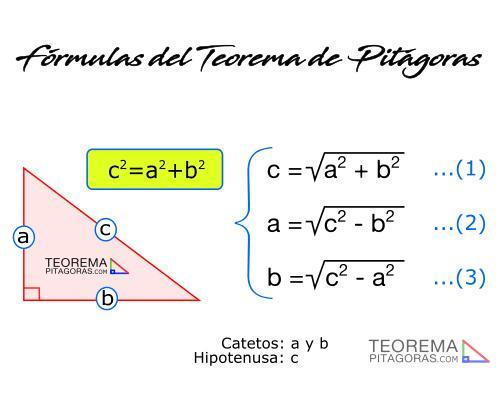
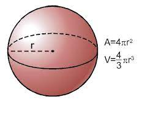

## Parte 2: Lo básico, números, cadenas y variables

- Números (int, float)
- Booleanos (True, False)
- Cadenas (str)
- Conversión de tipos de dato
- Variables y nombres

### Tipos de datos

**Números (int, float)**

En Python existe el tipo de dato `int` para representar cualquier número entero y el tipo `float` para representar cualquier número con decimales.

Las operaciones principales que se pueden realizar entre números en Python son las siguientes:

- Suma +
- Resta -
- Producto *
- División incluyendo decimales: /
- División hacia abajo: //
- Módulo o residuo: %
- Potencia: **
- Incremento, decremento: +=, -=

Vamos a iniciar IPython y comprobar estas operaciones con algunos números.

Ahora vamos realizar un ejemplo de como aplicar las operaciones haciendo uso del teorema de pitágoras:



Usando IPython y considerandos los valores de `a=150` y `b=300` calcula el valor de la hipotenusa `c=335.4101966249685`.

**Boleanos**

Los tipos booleanos en Python existen como valores definidos a diferencia de lenguajes como C, de tal forma que el valor verdadero se define con `True` y falso como `False`.

Las operaciones son las siguientes:

- Y lógico: `and`
- O lógico: `or`
- Negación: `not`

Realiza algunas operaciones usando IPython

**Cadenas (str)**

Las cadenas de texto o strings son uno de los tipos más importantes, ya que nos permite manipular todo tipo de información de texto.

En Python a diferencia de otros lenguajes de programación las cadenas se pueden crear encerrando el texto entre comillas dobles `"texto"` o entre apóstrofes o comillas simples `'texto'`, el uso es indistinto.

Las operaciones que se pueden realizar con cadenas son las siguientes:

- Suma o concatenación: `+`
- Multiplicación o replicación: `*`
- Indezación: `[]`
- Obtener longitud: `len(cadena)`
- Adición: `+=`
- Métodos:
  - `.upper()`
  - `.lower()`
  - `.capitalize()`
  - `.count()`
  - `.title()`
  - `.replace()`
  - Obtener ayuda con `?`  

Realizar algunos ejemplos con IPython para observar el comportamiento.

Ahora algunos ejercicios, transforma las siguientes cadenas según se indica:

- `don quijote de la mancha` en nombre propio
- `dir_user` en mayúsculas
- `Foto.Jpg` en minúsculas
- `Reporte para subir mi sueldo.pdf` remplaza espacio por guiones `-`.
- `-` repite hasta llenar la línea
- `Lo simple es bello` obtén la letra en la 9a posición

### Conversión de tipos de datos

Python proporciona una función para cada tipo de datos que permite convertir desde otros tipos de datos, siempre y cuando la conversión sea válida:

Lista de funciones:

- `int(valor)` Convierte valor a un entero en base 10
- `float(valor)` Convierte valor en un número con decimales
- `bool(valor)` Convierte valor en `True` o `False`
- `str(valor)` Convierte valor en cadena (`str`)

Realizar algunos ejemplos con IPython para observar el comportamiento.

**Leyendo datos desde la entrada estándar**

La función `input(mensaje)` nos permite leer datos desde la entrada estándar y regresa el valor leído como un `str` no importando si el datos es un número, así que se necesita obtener un valor numérico para realizar operaciones, entonces el valor se tiene que convertir primero al tipo deseado.

Por ejemplo vamos a leer la edad de una persona y calcular su edad dentro de 15 años haciendo uso de IPython:

```
int(input("Dame tu edad")) + 15
```

Veremos más ejemplos adelante.

### Variables

Las variables en Python son etiquetas a bloques de memoria que guardan un tipo de dato, así que el tipo de dato de una variable es el tipo de dato del valor que almacena, lo que se conoce como tipado dińamico ya que el tipo de una variable puede ir cambiando conforme su valor cambia.
  
Las variables en Python se crean al asignarles un valor con el operador de asginación `=`.

Ejemplo, calcula el área de un circulo haciendo uso de la fómula `area = pi * radio²`, donde `pi = 3.14159` y `radio = 50`.


Ejercicio, ahora calcula el volumen de la Tierra y el Sol considerando que sus radios son de 6 371 y 696 340 km respectivamente. Podrías indicar ¿cuántas veces cabe la Tierra en el Sol?



Ejercicio, elimina los acentos del siguiente texto haciendo uso de una variable y los métodos de cadenas:

```
Siempre he creído que si trabajas los resultados vendrán solos. No hago las cosas a medias, porque sé que si lo hago entonces sólo puedo esperar tener resultados a medias
```

Ejemplo, crear el script `area-circulo.py` obtenga el valor de un radio proporcionado por el usuario e imprima el valor del área del círculo como resultado.
  
**Nota:** Recuerda que todo lo leído por `input()` desde la entrada estándar es una cadena (str)


Ejemplo, si queremos automatizar tareas, el uso de la función `input()` puede ser no muy apropiada, así que es mejor obtener los datos del usuario desde la línea de comandos, así que ahora vamos a crear el script `area-circulo-auto.py` para que lea el valor del radio desde la línea de comando e imprima el valor del área del círculo.

Ahora ejecuta el script en shell `areas.sh` y observa el resultado.

Ejercicio, crea el script `normaliza.py` que te permita remplazar los espacio por guiones y que además convierta a minúsculas cualquier nombre de archivo que te porporcione el usuario en la línea de comandos:
  
```sh
$ python normaliza.py "mi archivo de la escuela.doc"
mi-archivo-de-la-escuela.doc
```
